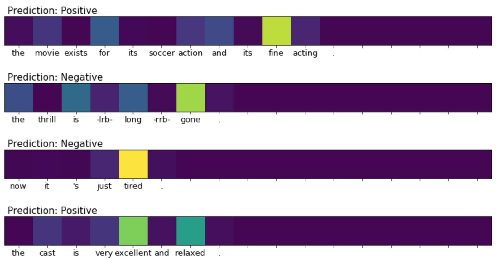

# Grad-CAM for Text

This is implementation of [Grad-CAM][grad-cam] for text classification model. The model used is 1D-CNN for text classification which was introduced in [Yoon Kim (2014)][yoon-kim]. The data used are re-fined version of [Stanford Sentimental Treebank][sst] which re-labeled for binary classification. Input feature is slim version of word2vec.

It especially requires python>=3, tensorflow>=1.4,<2.0 (requires tf.data.Dataset and tf.estimator.Estimator, but not support TF2).



## Installation
```sh
>>> pip3 install -r requirements.txt
```

## Feature
Before training, it requires word2vec binary file. Download by `word2vec.sh`, it will download in directory word2vec/.
```sh
>>> ./word2vec.sh
```
**All word2vec binary have to be located on word2vec/ directory.**
- word2vec/GoogleNews-vectors-negative300-SLIM.bin

[Stanford Sentimental Treebank Dataset][sst] will be download automatically when training.

## Training
```
usage: train.py [-h] [--epoch EPOCH] [--batch-size BATCH_SIZE]
                [--learning-rate LEARNING_RATE] [--gpu-index GPU_INDEX]

optional arguments:
  -h, --help            show this help message and exit
  --epoch EPOCH         Train Epoch
  --batch-size BATCH_SIZE
                        Train Batch Size
  --learning-rate LEARNING_RATE
                        Train Learning Rate
  --gpu-index GPU_INDEX
                        GPU Index Number
```

## Visulization
It shows which word impacts the result with heatmap of sentence. Strong impact factor gets brighter color, otherwise darker color.

Fill `CKPT` variable with your ckeckpoint path in `visualize.ipynb`.


[grad-cam]: https://arxiv.org/pdf/1610.02391.pdf
[yoon-kim]: http://www.aclweb.org/anthology/D14-1181
[sst]: https://github.com/HaebinShin/stanford-sentiment-dataset
[visualize_sample]: ./visualize_sample.png
